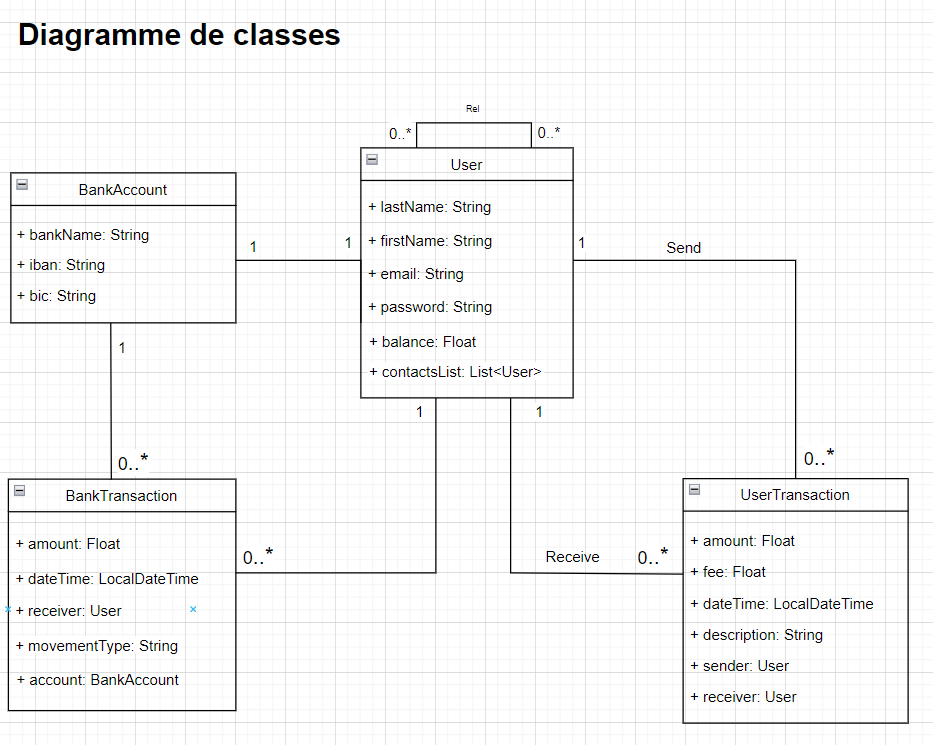
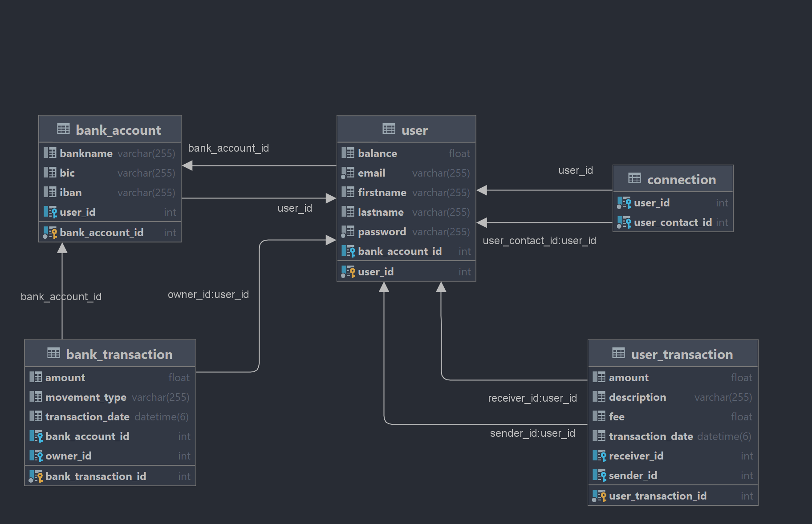

# Pay My Buddy

# Database

## Before Running App

Before running the application, you must create the database with the following commands:

CREATE DATABASE pay_my_buddy;

USE pay_my_buddy;

When the application is run for the first time, the tables will be created automatically using Spring Boot and Spring
Data,

# Endpoints

- **Application:**  http://localhost:9091/ - Login with "User" + generated password

# Security

- The user passwords are encrypted with BCryptPasswordEncoder (Spring Security).

## UML DIAGRAM CLASS

## MPD

